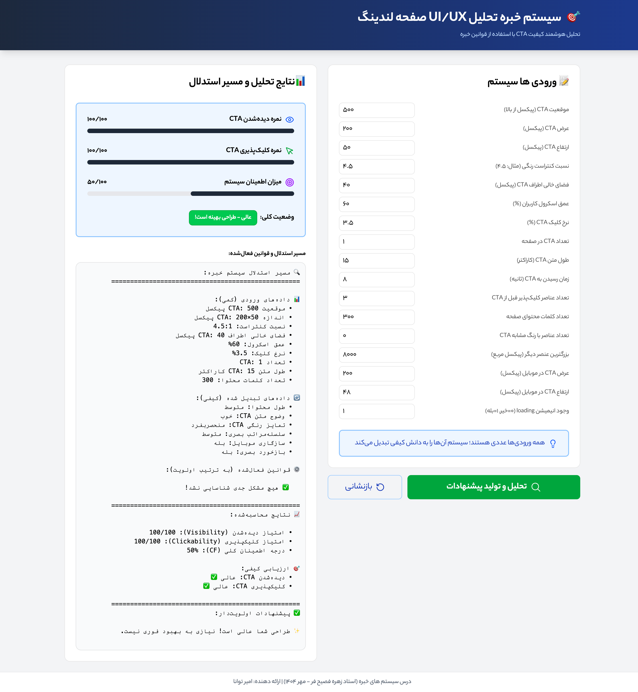

# 🎯 UI/UX Expert System for Landing Pages

> A rule-based expert system that analyzes and optimizes landing page UI/UX with instant AI-powered recommendations.

[](https://www.python.org/downloads/)
[](https://fastapi.tiangolo.com/)
[](https://reactjs.org/)
[](LICENSE)

[English](#english) | [فارسی](#فارسی)

---

## English

### 🚀 What is this?

An intelligent system that automatically analyzes your landing page's Call-to-Action (CTA) elements and provides actionable optimization suggestions. Built with **Forward Chaining** algorithm and **14 expert rules** based on industry standards.

### ✨ Features

- 🎯 **14 Expert Rules** - Based on WCAG, Nielsen Norman, Material Design
- 👁️ **Visibility Check** - Position, contrast, whitespace, color uniqueness
- 👆 **Clickability Check** - Size, text clarity, mobile-friendly, feedback
- 📊 **Scoring System** - Get 0-100 scores for visibility & clickability
- 🔍 **Explainable AI** - See exactly why each rule was triggered
- 🌐 **REST API** - Easy integration with any platform

### 📸 Screenshots




### 🛠️ Tech Stack

**Backend:**
- FastAPI (Python)
- Pydantic for validation
- Forward Chaining algorithm
- Certainty Factor calculation

**Frontend:**
- React 19
- TailwindCSS
- Vite
- Fetch API

### 📦 Installation

#### Backend

```bash
# Clone the repository
git clone https://github.com/amirtvn04/expert-system-ui-ux.git
cd expert-system-ui-ux

# Install dependencies
pip install -r requirements.txt

# Run the server
uvicorn main:app --reload --port 8000
```

#### Frontend

```bash
# Install dependencies
npm install

# Run dev server
npm run dev
```

Visit `http://localhost:5173` for the UI and `http://localhost:8000/docs` for API docs.

### 🎮 Usage

#### Web Interface

1. Open the app
2. Enter your CTA parameters (17 inputs)
3. Click "Analyze"
4. Get instant recommendations!

#### API

```bash
curl -X POST "http://localhost:8000/api/analyze" \
  -H "Content-Type: application/json" \
  -d '{
    "cta_position_y": 500,
    "cta_width": 200,
    "cta_height": 50,
    "contrast_ratio": 4.5,
    "whitespace_around_cta": 40,
    "scroll_depth": 60,
    "cta_click_rate": 3.5,
    "number_of_ctas": 1,
    "cta_text_length": 15,
    "time_to_cta": 8,
    "clickable_elements_before_cta": 3,
    "content_word_count": 300,
    "similar_color_elements": 0,
    "largest_other_element_size": 8000,
    "cta_mobile_width": 200,
    "cta_mobile_height": 48,
    "has_loading_animation": 1
  }'
```

**Response:**

```json
{
  "visibility_score": 100,
  "clickability_score": 100,
  "overall_certainty": 0.5,
  "activated_rules": [],
  "recommendations": [],
  "summary": {
    "overall_status": "Perfect design! ✨",
    "average_score": 100
  }
}
```

### 📚 API Endpoints

| Method | Endpoint | Description |
|--------|----------|-------------|
| `GET` | `/` | API info |
| `GET` | `/api/health` | Health check |
| `GET` | `/api/rules` | List all 14 rules |
| `POST` | `/api/analyze` | Full analysis with explanations |
| `POST` | `/api/analyze/simple` | Quick analysis (scores only) |

### 🧠 Knowledge Base

The system uses **14 expert rules** across 3 categories:

#### Visibility Rules (6)
- **V1:** CTA position (Priority: 10, CF: 0.95)
- **V2:** Color contrast (Priority: 9, CF: 0.90)
- **V3:** Whitespace (Priority: 8, CF: 0.85)
- **V4:** Multiple CTAs (Priority: 7, CF: 0.80)
- **V5:** Color uniqueness (Priority: 6, CF: 0.75)
- **V6:** Visual hierarchy (Priority: 5, CF: 0.70)

#### Clickability Rules (6)
- **C1:** CTA size (Priority: 10, CF: 0.95)
- **C2:** Text length (Priority: 9, CF: 0.90)
- **C3:** Text clarity (Priority: 8, CF: 0.85)
- **C4:** Clickable elements (Priority: 7, CF: 0.80)
- **C5:** Mobile-friendly (Priority: 6, CF: 0.75)
- **C6:** Visual feedback (Priority: 5, CF: 0.70)

#### Composite Rules (2)
- **M1:** Time to CTA
- **M2:** Click rate + contrast

### 📊 Example Analysis

**Good Design:**
```
Input: CTA at 400px, 250×60 size, 7:1 contrast
Output: ✅ Visibility: 100/100, Clickability: 100/100
```

**Bad Design:**
```
Input: CTA at 950px, 150×40 size, 2:1 contrast
Output: ❌ Visibility: 35/100, Clickability: 40/100
10 rules triggered with actionable fixes!
```

---

## فارسی

### 🚀 این پروژه چیست؟

یک سیستم خبره هوشمند که به صورت خودکار عناصر Call-to-Action صفحه لندینگ شما را تحلیل کرده و پیشنهادات بهینه‌سازی ارائه می‌دهد. ساخته شده با الگوریتم **Forward Chaining** و **14 قانون تخصصی**.
### ✨ ویژگی‌ها

- 🎯 **14 قانون تخصصی** - بر اساس استانداردهای WCAG، Nielsen Norman، Material Design
- 👁️ **بررسی دیده‌شدن** - موقعیت، کنتراست، فضای خالی، تمایز رنگی
- 👆 **بررسی کلیک‌پذیری** - اندازه، وضوح متن، موبایل، بازخورد بصری
- 📊 **سیستم امتیازدهی** - امتیاز 0-100 برای دیده‌شدن و کلیک‌پذیری
- 🔍 **قابل توضیح** - مشاهده دقیق دلیل فعال‌سازی هر قانون
- 🌐 **REST API** - یکپارچه‌سازی آسان با هر پلتفرمی

### 🛠️ تکنولوژی‌ها

**Backend:**
- FastAPI (Python)
- Pydantic برای اعتبارسنجی
- الگوریتم Forward Chaining
- محاسبه Certainty Factor

**Frontend:**
- React 19
- TailwindCSS
- Vite
- Fetch API

### 📦 نصب و راه‌اندازی

#### Backend

```bash
# کلون کردن پروژه
git clone https://github.com/amirtvn04/expert-system-ui-ux.git
cd expert-system-ui-ux

# نصب وابستگی‌ها
pip install -r requirements.txt

# اجرای سرور
uvicorn main:app --reload --port 8000
```

#### Frontend

```bash
# نصب وابستگی‌ها
npm install

# اجرای سرور توسعه
npm run dev
```

برای رابط کاربری به `http://localhost:5173` و برای مستندات API به `http://localhost:8000/docs` بروید.

### 🎮 نحوه استفاده

#### رابط وب

1. برنامه را باز کنید
2. پارامترهای CTA را وارد کنید (17 ورودی)
3. روی "تحلیل" کلیک کنید
4. پیشنهادات فوری دریافت کنید!

#### API

```bash
curl -X POST "http://localhost:8000/api/analyze" \
  -H "Content-Type: application/json" \
  -d '{
    "cta_position_y": 900,
    "cta_width": 150,
    "contrast_ratio": 2.5,
    ...
  }'
```

### 📚 Endpoints

| متد | آدرس | توضیح |
|-----|------|-------|
| `GET` | `/` | اطلاعات API |
| `GET` | `/api/health` | بررسی سلامت |
| `GET` | `/api/rules` | لیست 14 قانون |
| `POST` | `/api/analyze` | تحلیل کامل |
| `POST` | `/api/analyze/simple` | تحلیل ساده |

### 🧠 پایگاه دانش

سیستم از **14 قانون تخصصی** در 3 دسته استفاده می‌کند:

#### قوانین دیده‌شدن (6 قانون)
- موقعیت CTA، کنتراست رنگی، فضای خالی، تعداد CTA، تمایز رنگی، سلسله‌مراتب بصری

#### قوانین کلیک‌پذیری (6 قانون)
- اندازه CTA، طول متن، وضوح متن، عناصر کلیک‌پذیر، موبایل، بازخورد بصری

#### قوانین ترکیبی (2 قانون)
- زمان رسیدن به CTA، نرخ کلیک + کنتراست

### 📊 مثال تحلیل

**طراحی خوب:**
```
ورودی: CTA در 400px، اندازه 250×60، کنتراست 7:1
خروجی: ✅ دیده‌شدن: 100/100، کلیک‌پذیری: 100/100
```

**طراحی بد:**
```
ورودی: CTA در 950px، اندازه 150×40، کنتراست 2:1
خروجی: ❌ دیده‌شدن: 35/100، کلیک‌پذیری: 40/100
10 قانون فعال با پیشنهادات عملی!
```
- جوامع FastAPI و React

---

## 📝 Structure

```
expert-system-ui-ux/
├── backend/
│   ├── main.py              # FastAPI app
│   ├── requirements.txt     # Python dependencies
│   └── render.yaml         # Deployment config
├── frontend/
│   ├── src/
│   │   ├── App.jsx
│   │   ├── components/
│   │   │   ├── InputPanel.jsx
│   │   │   └── ResultsPanel.jsx
│   │   └── services/
│   │       └── apiService.js
│   ├── package.json
│   └── vite.config.js
├── docs/
│   └── documentation.md
└── README.md               # This file
```

## 🔗 Links

- **Repository:** https://github.com/amirtvn04/expert-system-ui-ux
- **Issues:** https://github.com/amirtvn04/expert-system-ui-ux/issues

---

<div align="center">

**If you found this helpful, please ⭐ star this repository!**

Made with ❤️ by Amir

</div>
